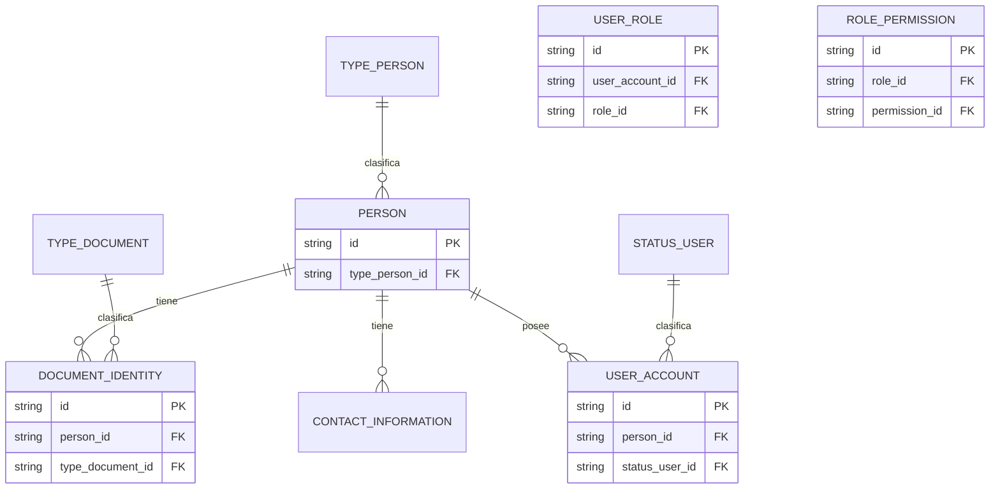
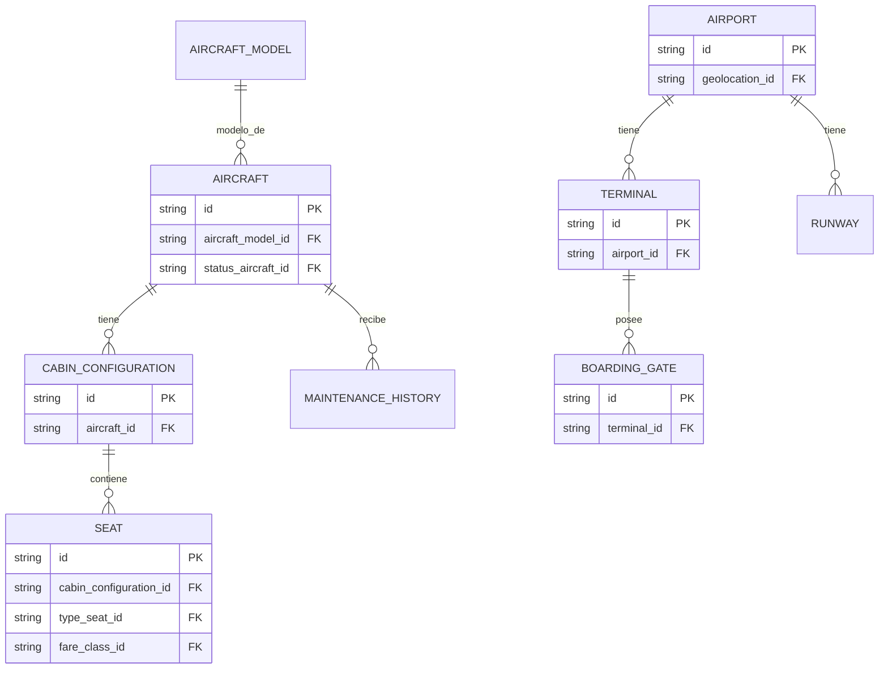
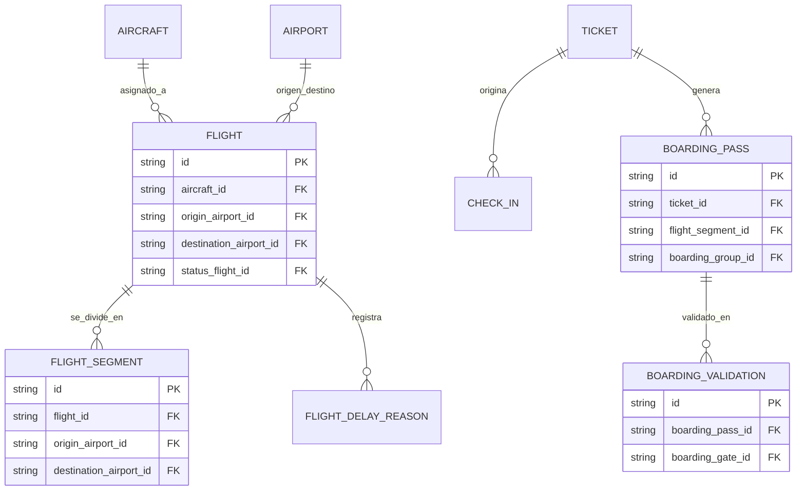
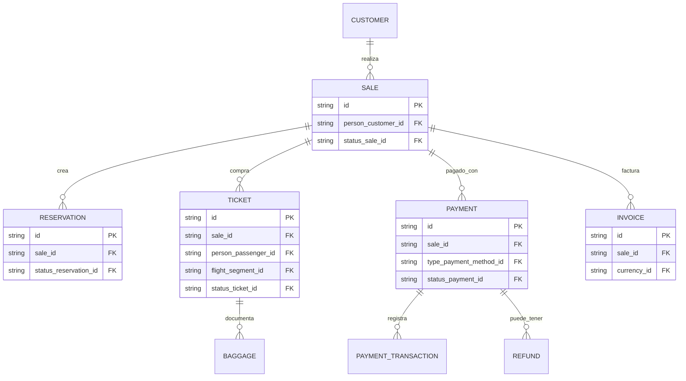
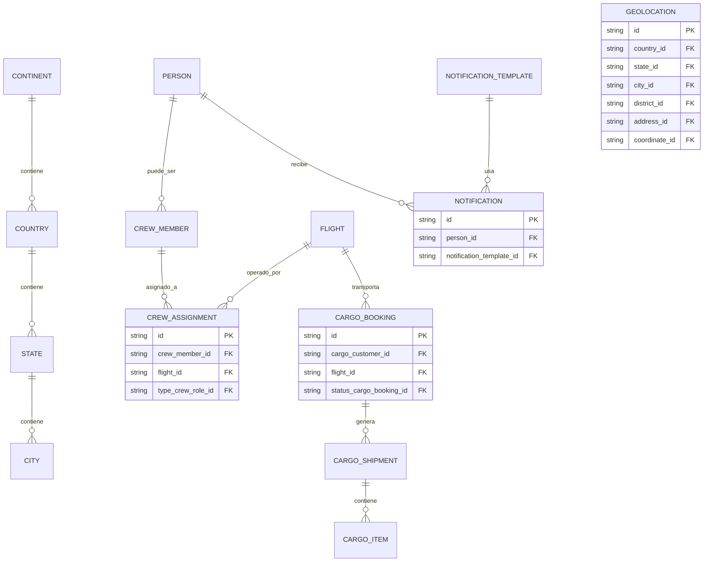

# Arquitectura de la Base de Datos "Aviones"

He analizado a detalle el archivo `Merrr Aviones.drawio`. Se trata de un modelo relacional sumamente completo (más de **80 tablas**), dividido inteligentemente en 15 módulos diferentes.

Debido al tamaño de la base de datos, si generamos un único diagrama `Mermaid` con todo, se verá demasiado saturado e ilegible. Por lo tanto, he estructurado los Diagramas de Entidad-Relación (DER) organizados por sus respectivos módulos.

### 1. Identity & Security (Identidad y Seguridad)
Gestiona la información de las personas y el sistema de acceso mediante roles y permisos.

### 2. Aircfraft & Airport (Aeronaves y Aeropuertos)
Controla el estado de las aeronaves, los modelos, sus asientos y las infraestructuras aeroportuarias físicas.

### 3. Flights & Boarding (Vuelos y Abordaje)
Estructura los segmentos de vuelo, las estaciones de origen/destino y el flujo de los pasajeros para el pase de abordar.

### 4. Sales, Payment & Billing (Ventas, Pagos y Facturación)
El ecosistema de compras, donde una Venta se relaciona a las Reservas, Entradas (Tickets) y Equipaje, culminando en transacciones financieras e impuestos.

### 5. Geo, Crew, Cargo & Notifications
Manejo de rutas geográficas, horarios de la tripulación en base al vuelo, envío de carga y sistema de envío de notificaciones.

> [!NOTE]
> Las sub-tablas ruteadoras estáticas (como `type_currency`, `status_payment`, `status_crew`) han sido omitidas gráficamente del diagrama Mermaid arriba para concentrarnos en dar una visión directa de la arquitectura, aunque en el script detectamos que sí están vinculadas correctamente mediante IDs y las tablas están perfectamente normalizadas.
