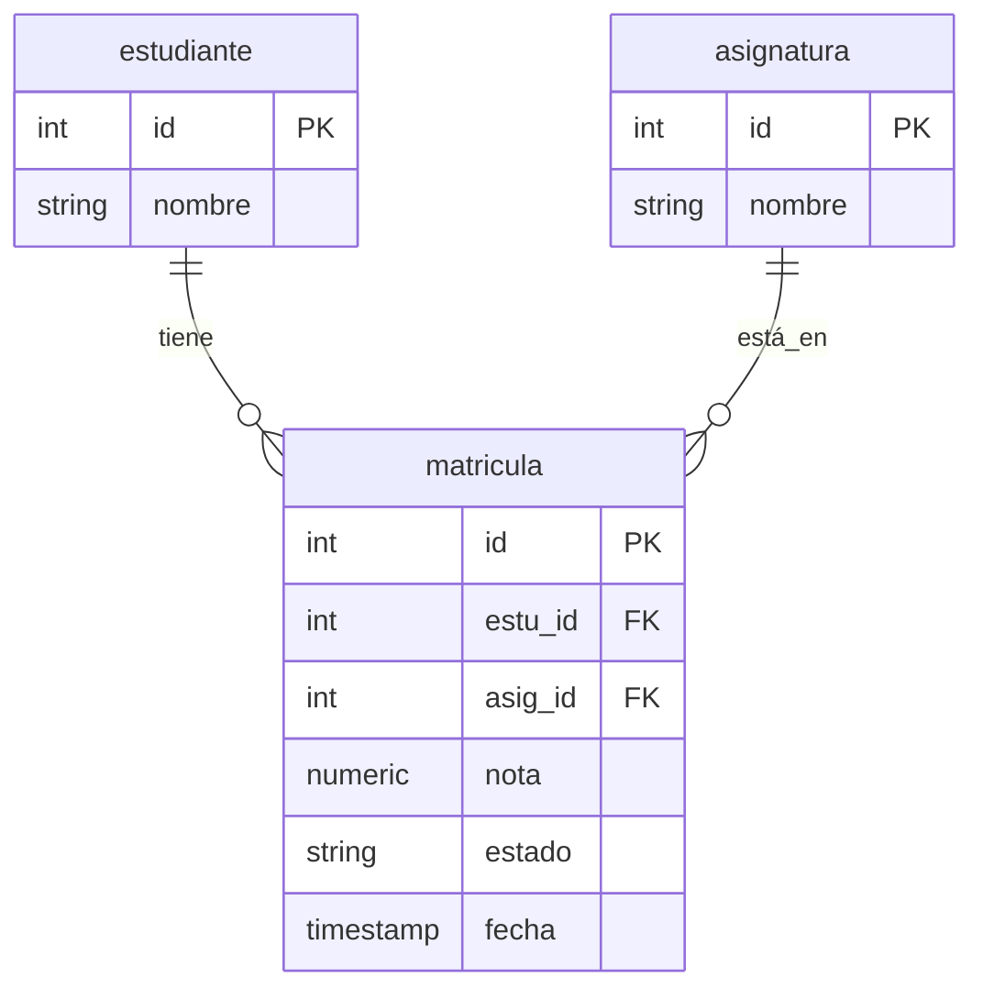

# Diagrama Modelo Entidad-Relación (MER)

Este diagrama representa la estructura de la tabla `matricula` y sus relaciones sugeridas basadas en el archivo `gestion_academica.sql`.

## Diagrama ER (Mermaid)

## Descripción de Entidades

-   **estudiante**: Representa a los alumnos del sistema (inferida por `estu_id`).
-   **asignatura**: Representa las materias o cursos (inferida por `asig_id`).
-   **matricula**: Registra la inscripción de un estudiante en una asignatura, incluyendo su nota final, estado y fecha de registro.

## Detalles del Proceso
El script `gestion_academica.sql` incluye un procedimiento almacenado `sp_registrar_nota_final` que actualiza la tabla `matricula` validando que el ID exista y que la nota esté en un rango de 0.0 a 5.0.
